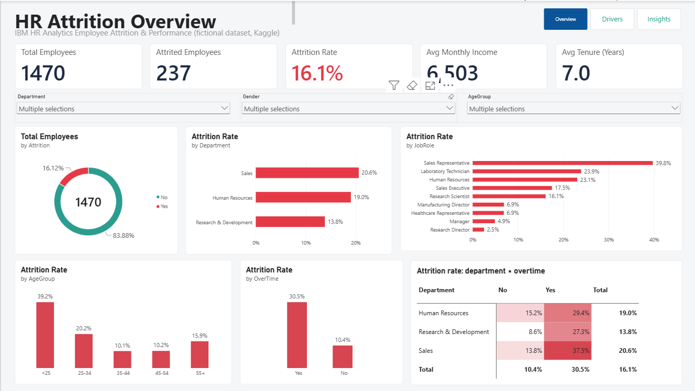
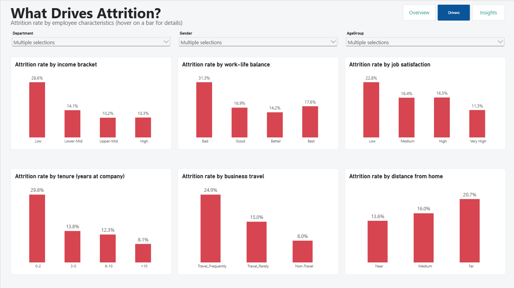
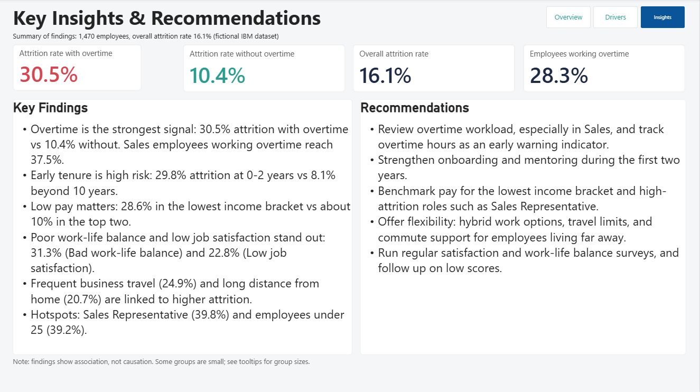

**Bahasa:** English | [Bahasa Indonesia](README.id.md)
# HR Attrition Dashboard (Power BI)

An interactive Power BI dashboard that explores **why employees leave** and which workforce characteristics are associated with higher attrition. Built end to end: data cleaning in Power Query, a data model with DAX measures, and a three-page report with recommendations for HR.

## Dashboard Preview

**1. Overview**


**2. Drivers**


**3. Insights & Recommendations**


## Business Questions

1. What is the overall attrition rate, and which departments and job roles have the highest?
2. Is working overtime associated with employees leaving?
3. How do income, tenure, work-life balance, job satisfaction, business travel, and commute distance relate to attrition?

## Dataset

- **Source:** [IBM HR Analytics Employee Attrition & Performance](https://www.kaggle.com/datasets/pavansubhasht/ibm-hr-analytics-attrition-dataset) on Kaggle
- **Size:** 1,470 employees, 35 columns (32 after removing constant columns)
- **Note:** This is a fictional dataset created by IBM data scientists, so results illustrate the analysis approach and do not describe a real company.
- The raw CSV is not included in this repository; please download it from Kaggle.

## Project Workflow

1. **Data cleaning (Power Query)**
   - Checked data types, missing values, and duplicate employee IDs (none found)
   - Removed columns with a single constant value (`EmployeeCount`, `Over18`, `StandardHours`)
2. **Feature engineering**
   - Created `AttritionFlag` (1 = left, 0 = stayed)
   - Created grouped fields: `AgeGroup`, `TenureGroup`, `IncomeBracket`, `DistanceGroup`
   - Added readable labels for coded survey columns (e.g., `JobSatisfaction` 1-4 → Low to Very High)
3. **Data modeling**
   - Used *Sort by column* so groups and ratings appear in logical order instead of alphabetical order
   - Stored all measures in a dedicated `Measures` table
4. **DAX measures** (see below)
5. **Visualization**
   - Three report pages with consistent design, slicers (Department, Gender, Age Group), and page navigation
   - Used a defined colour palette and insight-focused chart titles

## Key DAX Measures

```dax
Total Employees = COUNTROWS(HR_Employee)

Attrited Employees = SUM(HR_Employee[AttritionFlag])

Attrition Rate = DIVIDE([Attrited Employees], [Total Employees])

Attrition Rate (Overtime) =
CALCULATE([Attrition Rate], HR_Employee[OverTime] = "Yes")

Attrition Rate (No Overtime) =
CALCULATE([Attrition Rate], HR_Employee[OverTime] = "No")

Overtime % =
DIVIDE(
    CALCULATE([Total Employees], HR_Employee[OverTime] = "Yes"),
    [Total Employees]
)
```

## Key Findings

| Factor | Higher-attrition group | Comparison |
|---|---|---|
| Overall | 16.1% (237 of 1,470 employees) | n/a |
| Overtime | 30.5% with overtime | 10.4% without overtime |
| Tenure | 29.8% at 0-2 years | 8.1% beyond 10 years |
| Income | 28.6% in the lowest bracket | about 10% in the top two brackets |
| Work-life balance | 31.3% when rated "Bad" | 14.2% to 17.6% in other groups |
| Job satisfaction | 22.8% when rated "Low" | 11.3% when rated "Very High" |
| Business travel | 24.9% travel frequently | 8.0% non-travel |
| Commute | 20.7% live far from work | 13.6% live near |
| Job role | 39.8% for Sales Representatives | 2.5% for Research Directors |

Other notable patterns: Sales employees working overtime reach 37.5% attrition, and employees under 25 show 39.2%.

## Recommendations

1. **Review overtime workload**, especially in Sales, and track overtime hours as an early warning indicator.
2. **Strengthen onboarding and mentoring** during the first two years of employment.
3. **Benchmark pay** for the lowest income bracket and for high-attrition roles such as Sales Representative.
4. **Offer flexibility**: hybrid work options, limits on business travel, and commute support for employees living far from the office.
5. **Run regular satisfaction and work-life balance surveys** and follow up on low scores.

## Limitations

- The dataset is fictional, and the findings show **association, not causation**.
- Some groups are small (for example, specific roles or the youngest age group), so percentages should be read together with group sizes.
- The dataset has no date column, so tenure is used instead of a time trend.

## How to Open the Report

1. Download `IBM-HR-Attrition-Dashboard.pbix` from this repository.
2. Open it with [Power BI Desktop](https://powerbi.microsoft.com/desktop/) (Windows).
3. Use the page buttons at the top right; in Desktop, hold **Ctrl** while clicking to navigate.
4. A PDF export of the report is also included: `IBM-HR-Attrition-Dashboard.pdf`.

## Tools

Power BI Desktop · Power Query · DAX

## Author

**Alnanda Kusuma**
Informatics student, Universitas Ahmad Dahlan
LinkedIn: https://www.linkedin.com/in/alnandakusuma/ · GitHub: https://github.com/alnandakusuma
